# Camera Calibration

## Aim
The aim of this project is to calibrate a camera using OpenCV to determine its intrinsic, extrinsic,
and distortion parameters. To achieve this, both a chessboard and a asymmetrical circle grid pattern are used.
The calibration process is tested on two different cameras to evaluate and compare the results. The distorted images are
undistorted using the obtained parameters.

## Implementation
### Setup
- The pattern is choosen using the `Patterntype`: `CHESSBOARD` or `CIRCLES_GRID`.
- The visualization type can also be choosen using the `VisualizationType`: `VECTOR_FIELD`, `HEATMAP`, `CHECKERBOARD`; I did all three, since I wanted to see which one highlighted the changes best. (I think heatmap is the best one, but the other ones look nice too)

### Image Collection
- A series of images are taken.
- For each frame, the algorithm tries to detect the pattern and extracts the 2D corner coordinates for the chessboard or the circles for the circle grid pattern. This done by using OpenCV's `findChessboardCorners` and `findCirclesGrid` functions. The `findCirclesGrid` utilizes a Blob Detector that was created some parameters that I found to work well for the circle grid pattern. I used a `minArea` of 100 and a `maxArea` of 6000. These parameters help determine circular blobs that fall into that area range.
- If the pattern is found, the pixel coordinates for the 2D points are refined using OpenCV's `cornerSubPix` function. 
- The refined points are drawn on the image using OpenCV's `drawChessboardCorners` and saved.

### Calibration
- The intrinsic, extrinsic, and distortion parameters are calculated using OpenCV's `calibrateCamera` function and the calulated points from the previous step.
- intrinsic: camera matrix
- extrinsic: rotation and translation vectors
- distortion: lens distortion

### Undistortion and Visualization
- The undistorted images are generated using OpenCV's `undistort` function
- The visualization of the undistorted images can be done using the `VisualizationType` mentioned above
    - Vector Field: This method displays the displacement of pixels before and after correction using vector arrows. This is done by using the OpenCv `arrowedLine` function to draw a vector from the original pixel to the undistorted point.
    - Heatmap: A heatmap is generated to visualize the pixel difference between the original and undistorted image. This is implemented using the OpenCV `applyColorMap` function.
    - Checkerboard: This method takes the original and the undistorted image and alternates between them to create a checkerboard pattern to highlight the differences. I used the helper function `checkerboard_overlay` that does the alternating and creates a new image.

## Results
### Camera 1 (external camera)
#### Chessboard

Output:
```
pattern found
pattern found
pattern found
pattern found
pattern found
pattern found
pattern found
pattern found
pattern found
pattern found

CAMERA CALIBRATED!!! ERR=0.2644292422306969

Camera matrix : 
[[435.11559873   0.         315.76084058]
 [  0.         436.25840529 236.57679327]
 [  0.           0.           1.        ]]
 
lens distortion : 
[[ 1.03305087e-01  1.44183297e-01  2.05561877e-04 -1.57766282e-03  -7.52931384e-01]]

extrinsic positions for ALL detected shapes
ROTATION rvecs : 
(array([[-0.04253126],
       [-0.0180601 ],
       [-1.57728555]]), array([[-0.08178071],
       [-0.04452583],
       [-1.57708703]]), array([[-0.04658767],
       [-0.00188421],
       [-1.57731481]]), array([[ 0.01441476],
       [ 0.08016035],
       [-1.53945464]]), array([[-0.050037  ],
       [ 0.1085555 ],
       [-1.39774918]]), array([[-0.07885117],
       [ 0.15153353],
       [-1.43905944]]), array([[-0.10870411],
       [ 0.14260297],
       [-1.78189928]]), array([[-0.11695539],
       [ 0.11007826],
       [-1.66324385]]), array([[ 0.05860223],
       [ 0.27010722],
       [-1.57120242]]), array([[ 0.26176039],
       [ 0.46203547],
       [-1.5029052 ]]))
TRANSLATION tvecs : 

(array([[-4.5873527 ],
       [ 2.70807144],
       [10.76561952]]), array([[-4.63861774],
       [ 2.700867  ],
       [10.87467926]]), array([[-4.59683576],
       [ 2.70787105],
       [10.74574093]]), array([[-4.78268505],
       [ 2.01633307],
       [12.6216303 ]]), array([[-4.34874824],
       [ 0.94328215],
       [14.63578013]]), array([[-4.0071575 ],
       [ 1.10278996],
       [15.78938267]]), array([[-3.36245784],
       [ 2.48782735],
       [16.91304963]]), array([[-3.78781096],
       [ 1.62622226],
       [19.1281876 ]]), array([[-3.86468621],
       [ 1.92290726],
       [21.32918599]]), array([[-3.92379193],
       [ 2.2909845 ],
       [20.87773881]]))
```

For the following image the rotation vector is: \
`rvec = [[-0.04658767], [-0.00188421], [-1.57731481]]` \
and the translation vector is: \
`tvec = [[-4.59683576], [2.70787105], [10.74574093]]`

The calibration was successful with an error of 0.2644292422306969.

Original Image: \


Image with corners detected: \


Calibration Results: \


Visualization with Vector Field: \


Visualization with Heatmap: \


Visualization with Checkerboard: \


#### Asymmetrical Circle Grid

Output:
```
pattern found
pattern found
pattern found
pattern NOT found
pattern found
pattern found
pattern found
pattern NOT found
pattern found
pattern found
camera calibration FAILED!! ERR=17.99214836244936
Camera matrix : 

[[2.00768206e+03 0.00000000e+00 3.24424048e+02]
 [0.00000000e+00 4.88597702e+03 4.01216595e+02]
 [0.00000000e+00 0.00000000e+00 1.00000000e+00]]
lens distortion : 

[[-4.43102693e+00 -9.27283457e+02 -2.74006563e-01  7.60486206e-02
   1.13353838e+05]]
extrinsic positions for ALL detected shapes
ROTATION rvecs : 

(array([[-0.49731907],
       [ 0.48435116],
       [ 1.51681749]]), array([[-0.49982983],
       [ 0.48256344],
       [ 1.51425792]]), array([[-0.48331408],
       [ 0.49177694],
       [ 1.52762017]]), array([[-0.43945662],
       [ 0.5235281 ],
       [ 1.54676958]]), array([[-0.50794451],
       [ 0.47438333],
       [ 1.50776518]]), array([[-0.41569979],
       [ 0.57895859],
       [ 1.5779194 ]]), array([[-0.40166109],
       [ 0.5968433 ],
       [ 1.58107636]]), array([[-0.31909355],
       [ 0.73184375],
       [ 1.66936297]]))
TRANSLATION tvecs : 

(array([[ 5.02854638],
       [-2.75849482],
       [52.73478115]]), array([[ 5.00760805],
       [-2.79344705],
       [53.24293555]]), array([[ 5.04945557],
       [-3.00448725],
       [57.77187447]]), array([[ 4.97821186],
       [-3.30838088],
       [66.52235797]]), array([[ 4.91398733],
       [-3.31070187],
       [59.23922384]]), array([[ 5.07870825],
       [-2.96577061],
       [52.56959866]]), array([[ 4.85247799],
       [-2.86466376],
       [49.25366307]]), array([[ 5.36038479],
       [-2.65277188],
       [49.65007351]]))
```

For the following image the rotation vector is: \
`rvec = [[-0.49731907], [ 0.48435116], [ 1.51681749]]` \
and the translation vector is: \
`tvec = [[ 5.02854638], [-2.75849482], [52.73478115]]`

Unfortunately, the calibration failed since the error is 17.99214836244936. The detection of the circle pattern is
not as robust as the chessboard pattern.

Original Image: \
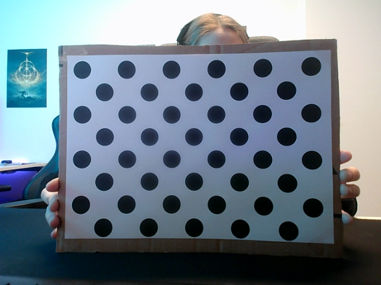

Image with corners detected: \
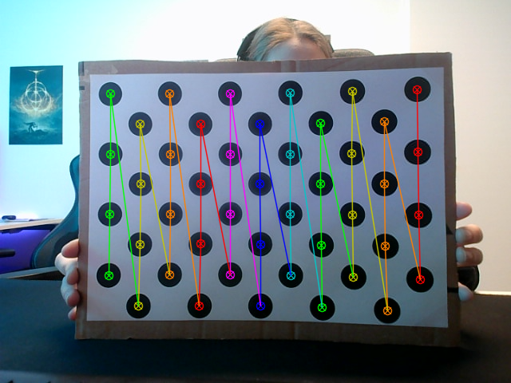

Calibration Results: \
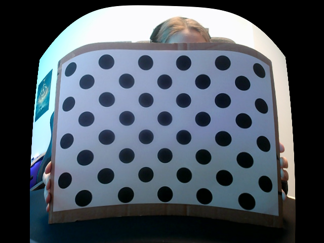

Visualization with Vector Field: \
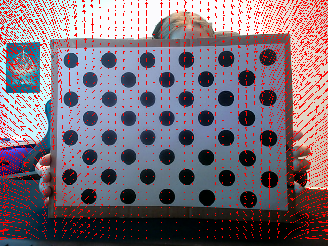

Visualization with Heatmap: \
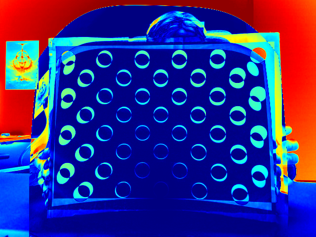

Visualization with Checkerboard: \
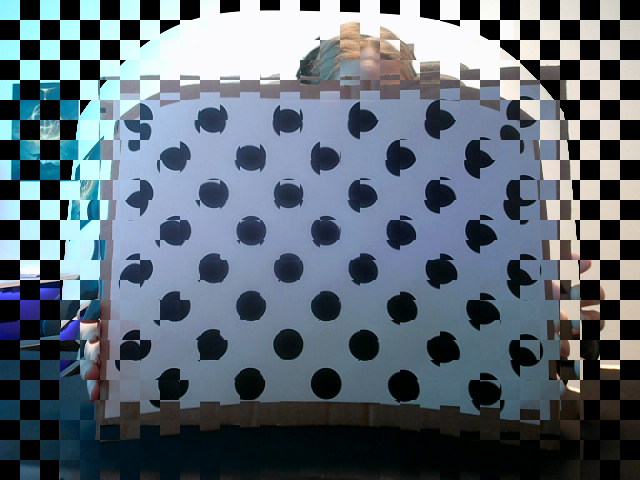

### Camera2 (integrated camera)
#### Chessboard

Output:
```
pattern found
pattern found
pattern found
pattern found
pattern found
pattern found
pattern found
pattern found
pattern found
pattern found
CAMERA CALIBRATED!!! ERR=0.447134568808251
Camera matrix : 

[[601.87250276   0.         325.07911905]
 [  0.         603.09453457 208.19971987]
 [  0.           0.           1.        ]]
lens distortion : 

[[-0.04843625 -0.03125308 -0.00300784  0.00363086  0.1520879 ]]
extrinsic positions for ALL detected shapes
ROTATION rvecs : 

(array([[-0.04988001],
       [ 0.03000733],
       [-1.5662192 ]]), array([[-0.03922926],
       [ 0.02953717],
       [-1.56436141]]), array([[-0.04870359],
       [-0.02169235],
       [-1.54693716]]), array([[-0.05684983],
       [-0.01286214],
       [-1.56493841]]), array([[-0.06103718],
       [ 0.03835695],
       [-1.54834413]]), array([[ 0.18118593],
       [ 0.28785182],
       [-1.50041477]]), array([[ 0.40638718],
       [ 0.26794562],
       [-1.62212263]]), array([[ 0.19395814],
       [-0.08141337],
       [-1.82351562]]), array([[-0.2344778 ],
       [-0.16674378],
       [-1.49588408]]), array([[-0.28735316],
       [ 0.02171034],
       [-1.22621736]]))
TRANSLATION tvecs : 

(array([[-3.88958729],
       [ 4.06923927],
       [15.27536998]]), array([[-3.82000233],
       [ 3.92614095],
       [15.16656203]]), array([[-3.95705288],
       [ 3.88950841],
       [13.30816445]]), array([[-3.78914865],
       [ 4.24102103],
       [11.91168094]]), array([[-3.70840355],
       [ 3.85103943],
       [14.57317501]]), array([[-3.6914817 ],
       [ 3.69734996],
       [16.92806255]]), array([[-4.05413576],
       [ 4.75240625],
       [16.43464926]]), array([[-3.70599935],
       [ 4.96243774],
       [15.86718144]]), array([[-3.97867523],
       [ 3.19636583],
       [16.65338764]]), array([[-3.61230365],
       [ 1.7866056 ],
       [17.53942151]]))
```

For the following image the rotation vector is: \
`rvec = [[-0.04988001], [0.03000733], [-1.5662192]]` \
and the translation vector is: \
`tvec = [[-3.88958729], [4.06923927], [15.27536998]]`

The calibration was successful with an error of 0.447134568808251.

Original Image: \
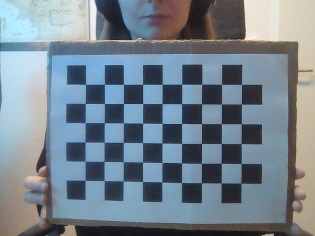

Image with corners detected: \
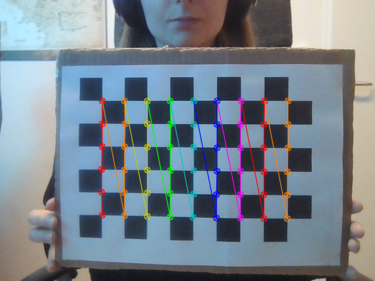

Calibration Results: \


Visualization with Vector Field: \
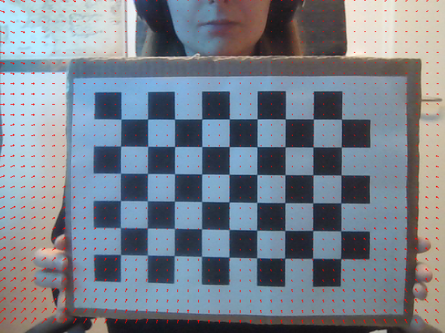

Visualization with Heatmap: \
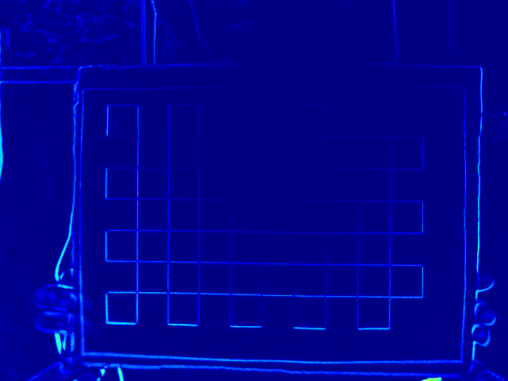

Visualization with Checkerboard: \
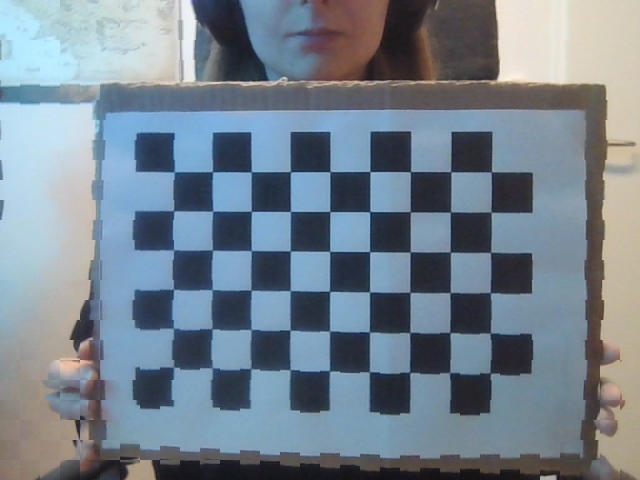

#### Circle Grid

Output:
```
pattern found
pattern found
pattern found
pattern found
pattern found
pattern found
pattern found
pattern found
pattern found
pattern found
camera calibration FAILED!! ERR=19.991159006992504
Camera matrix : 

[[7.20716883e+03 0.00000000e+00 3.82231601e+02]
 [0.00000000e+00 1.37937407e+04 2.38445145e+02]
 [0.00000000e+00 0.00000000e+00 1.00000000e+00]]
lens distortion : 

[[ 4.19372899e+01 -1.50477181e+04 -7.72230653e-01  4.61191148e-02
  -6.37182035e+01]]
extrinsic positions for ALL detected shapes
ROTATION rvecs : 

(array([[0.19203171],
       [0.35936983],
       [1.56015668]]), array([[0.18514357],
       [0.36756583],
       [1.56284286]]), array([[0.15356902],
       [0.44749274],
       [1.58760421]]), array([[0.1904703 ],
       [0.33588236],
       [1.56160626]]), array([[0.14189261],
       [0.41144649],
       [1.58801055]]), array([[0.04594312],
       [0.56826748],
       [1.63262951]]), array([[-0.01768579],
       [ 0.78009202],
       [ 1.70672518]]), array([[0.03266459],
       [1.14424791],
       [1.86603306]]), array([[-0.03964599],
       [-0.85981671],
       [ 1.71555909]]), array([[-0.75755253],
       [-0.05527337],
       [ 1.24810283]]))
TRANSLATION tvecs : 

(array([[  3.44424224],
       [ -1.10739392],
       [140.05831179]]), array([[  3.45143809],
       [ -1.12334034],
       [138.47536566]]), array([[  3.44970518],
       [ -1.02653926],
       [151.40949487]]), array([[  3.33345539],
       [ -1.22980648],
       [174.33079823]]), array([[  3.52037726],
       [ -1.28316865],
       [193.76117086]]), array([[  3.40285633],
       [ -1.22379758],
       [189.2846702 ]]), array([[  3.20318502],
       [ -0.75497833],
       [176.95130908]]), array([[  2.94301582],
       [ -0.34373368],
       [149.72883812]]), array([[  3.23701077],
       [ -0.63732354],
       [174.28134717]]), array([[  1.80492803],
       [ -1.93817278],
       [178.02023219]]))
```
For the following image the rotation vector is: \
`rvec = [[0.15356902], [0.44749274], [1.58760421]]` \
and the translation vector is: \
`tvec = [[3.44970518], [-1.02653926], [151.40949487]]`

The calibration failed since the error is 19.991159006992504.

Original Image: \
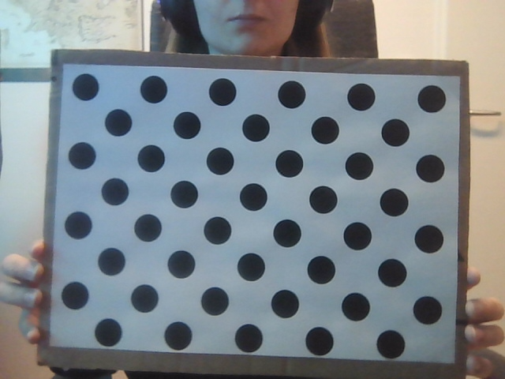

Image with corners detected: \
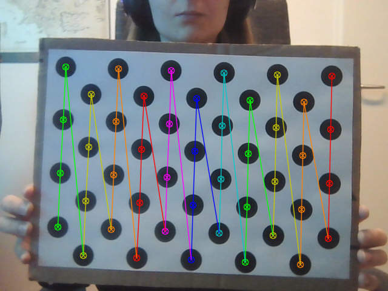

Calibration Results: \
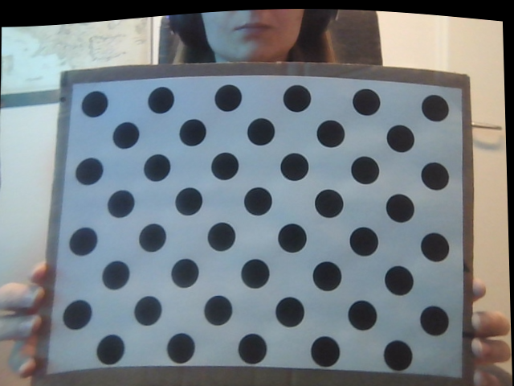

Visualization with Vector Field: \
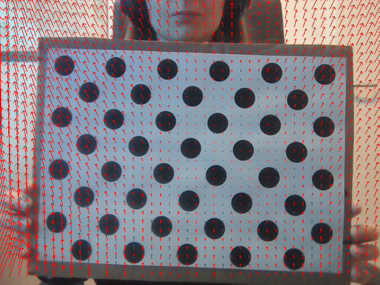

Visualization with Heatmap: \
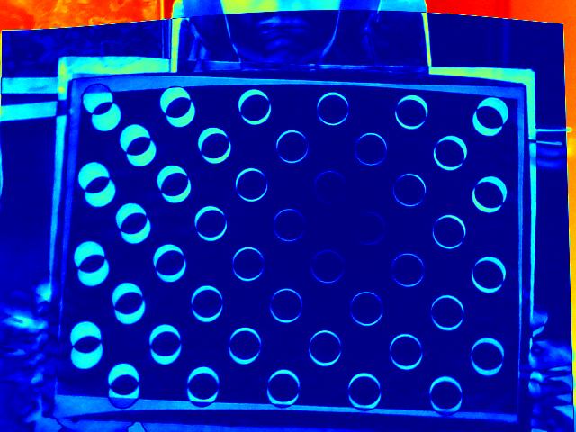

Visualization with Checkerboard: \
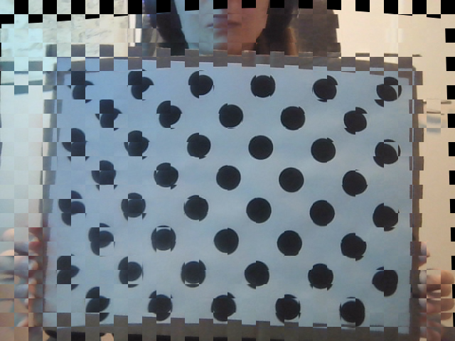

## Pattern Comparison 
- The chessboard pattern seems to be more robust for the calibration compared to the circle grid pattern, since th corner detection is more accurate and consistent.

## Camera Comparison (with chessboard pattern)
### Calibration Error 
- The first camera has a calibration error of 0.2644, while the second camera has a calibration error of 0.4471.
- -> the calibration of the first camera is more accurate than the second camera.

### Intrinsic Parameters (Camera Matrix)
- The camera matrix of the first camera is:
```
[[435.11559873   0.         315.76084058]
 [  0.         436.25840529 236.57679327]
 [  0.           0.           1.        ]]
```
- The camera matrix of the second camera is:
```
[[601.87250276   0.         325.07911905]
 [  0.         603.09453457 208.19971987]
 [  0.           0.           1.        ]]
```
Focal Length:
- The first camera has a focal length of 435.1156 in the x direction and 436.2584, which is lower than the second camera's focal length of 601.8725 in the x direction and 603.0945 in the y direction.
- this indicates that the first camera has a wider field of view than the second camera.

Optical Center:
- The optical center of the first camera is at (315.7608, 236.5768), while the second camera's optical center is at (325.0791, 208.1997).

### Lens Distortion
- The first camera has a lens distortion of:
```
[[ 1.03305087e-01  1.44183297e-01  2.05561877e-04 -1.57766282e-03  -7.52931384e-01]]
```
- The second camera has a lens distortion of:
```
[[-0.04843625 -0.03125308 -0.00300784  0.00363086  0.1520879 ]]
```
- The values of the first camera are overall higher than the second camera, indicating that the first camera has a higher distortion than the second camera.

### Extrinsic Parameters
- The rotation and translation vectors of the first camera (and chosen image) are:
```
rvec = [[-0.04658767], [-0.00188421], [-1.57731481]]
tvec = [[-4.59683576], [2.70787105], [10.74574093]]

```

- The rotation and translation vectors of the second camera (and chosen image) are:
```
rvec = [[-0.04988001], [0.03000733], [-1.5662192]]
tvec = [[-3.88958729], [4.06923927], [15.27536998]]
```

- Both vector are rather similar, but the translation vector of the second camera is higher in the z direction, indicating that the second camera is further away from the chessboard pattern than the first camera.

## Used Libraries
- OpenCV: for camera calibration and image processing
- NumPy: for numerical operations and array manipulations
- time: to wait between frames
- enum: for defining enumerations for the pattern and visualization types