# Camera Calibration

## Aim
The aim of this project is to calibrate a camera using OpenCV to determine its intrinsic, extrinsic,
and distortion parameters. To achieve this, both a chessboard and a circle grid pattern are used.
The calibration process is tested on two different cameras to evaluate and compare the results. The distorted images are
undistorted using the obtained parameters.

## Implementation
### Setup
- The pattern is choosen using the `Patterntype`: `CHESSBOARD` or `CIRCLES_GRID`.
- The visualization type can also be choosen using the `VisualizationType`: `VECTOR_FIELD`, `HEATMAP`, `CHECKERBOARD`

### Image Collection
- A series of images are taken.
- For each frame, the algorithm tries to detect the pattern and extracts the 2D corner coordinates and the 3D object points

### Calibration
- The intrinsic, extrinsic, and distortion parameters are calculated using OpenCV's `calibrateCamera` function and the calulated points
- intrinsic: camera matrix
- extrinsic: rotation and translation vectors
- distortion: lens distortion

### Undistortion and Visualization
- The undistorted images are generated using OpenCV's `undistort` function
- The visualization of the undistorted images can be done using the `VisualizationType` mentioned above
    - Vector Field: This method displays the displacement of pixels before and after correction using vector arrows.
    - Heatmap: A heatmap is generated to visualize the pixel difference between the original and undistorted image.
    - Checkerboard: This method blends the original and undistorted images to highlight the changes, making the corrections visible

## Results
### Camera 1 (Webcam)
#### Chessboard
```
pattern found
pattern found
pattern found
pattern found
pattern found
pattern found
pattern found
pattern found
pattern found
pattern found

CAMERA CALIBRATED!!! ERR=0.2644292422306969

Camera matrix : 
[[435.11559873   0.         315.76084058]
 [  0.         436.25840529 236.57679327]
 [  0.           0.           1.        ]]
 
lens distortion : 
[[ 1.03305087e-01  1.44183297e-01  2.05561877e-04 -1.57766282e-03  -7.52931384e-01]]

extrinsic positions for ALL detected shapes
ROTATION rvecs : 
(array([[-0.04253126],
       [-0.0180601 ],
       [-1.57728555]]), array([[-0.08178071],
       [-0.04452583],
       [-1.57708703]]), array([[-0.04658767],
       [-0.00188421],
       [-1.57731481]]), array([[ 0.01441476],
       [ 0.08016035],
       [-1.53945464]]), array([[-0.050037  ],
       [ 0.1085555 ],
       [-1.39774918]]), array([[-0.07885117],
       [ 0.15153353],
       [-1.43905944]]), array([[-0.10870411],
       [ 0.14260297],
       [-1.78189928]]), array([[-0.11695539],
       [ 0.11007826],
       [-1.66324385]]), array([[ 0.05860223],
       [ 0.27010722],
       [-1.57120242]]), array([[ 0.26176039],
       [ 0.46203547],
       [-1.5029052 ]]))
TRANSLATION tvecs : 

(array([[-4.5873527 ],
       [ 2.70807144],
       [10.76561952]]), array([[-4.63861774],
       [ 2.700867  ],
       [10.87467926]]), array([[-4.59683576],
       [ 2.70787105],
       [10.74574093]]), array([[-4.78268505],
       [ 2.01633307],
       [12.6216303 ]]), array([[-4.34874824],
       [ 0.94328215],
       [14.63578013]]), array([[-4.0071575 ],
       [ 1.10278996],
       [15.78938267]]), array([[-3.36245784],
       [ 2.48782735],
       [16.91304963]]), array([[-3.78781096],
       [ 1.62622226],
       [19.1281876 ]]), array([[-3.86468621],
       [ 1.92290726],
       [21.32918599]]), array([[-3.92379193],
       [ 2.2909845 ],
       [20.87773881]]))
```

For the following image the rotation vector is: \
`rvec = [[-0.04658767], [-0.00188421], [-1.57731481]]` \
and the translation vector is: \
`tvec = [[-4.59683576], [2.70787105], [10.74574093]]`

The calibration was successful with an error of 0.2644292422306969.

Original Image: \
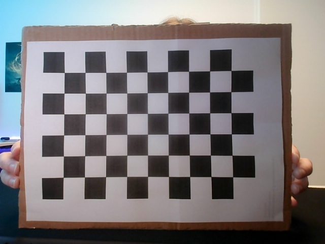

Image with corners detected: \
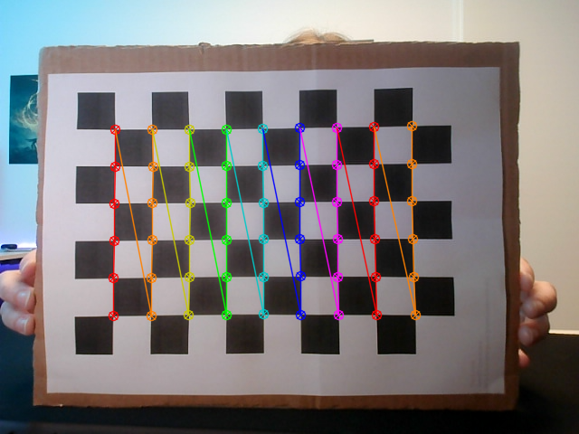

Calibration Results: \
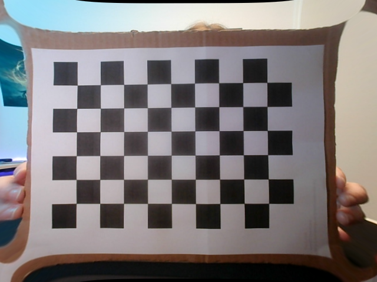

Visualization with Vector Field: \
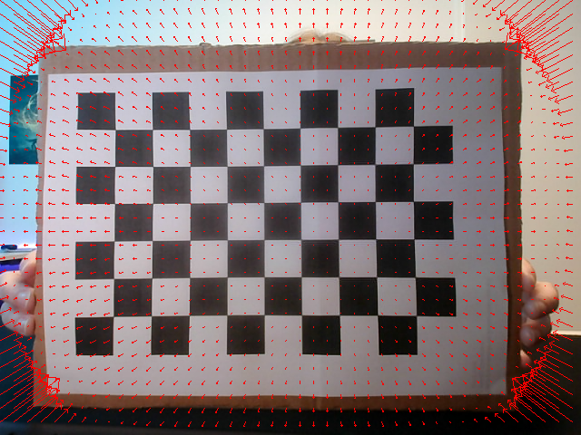

Visualization with Heatmap: \
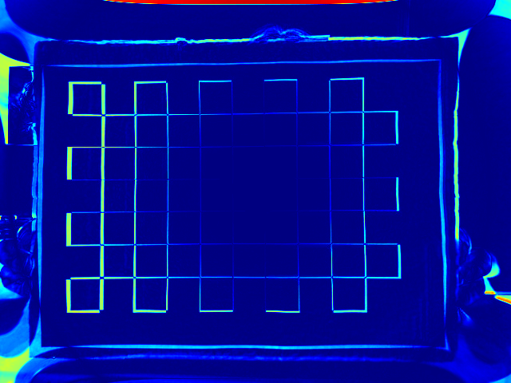

Visualization with Checkerboard: \
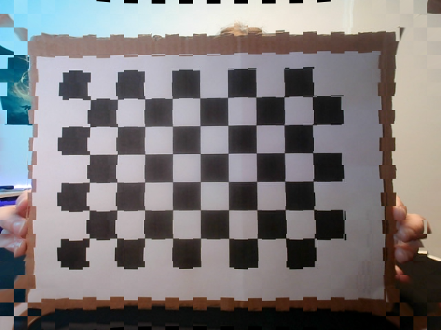


#### Circle Grid

```
pattern found
pattern found
pattern found
pattern NOT found
pattern found
pattern found
pattern found
pattern NOT found
pattern found
pattern found
camera calibration FAILED!! ERR=17.99214836244936
Camera matrix : 

[[2.00768206e+03 0.00000000e+00 3.24424048e+02]
 [0.00000000e+00 4.88597702e+03 4.01216595e+02]
 [0.00000000e+00 0.00000000e+00 1.00000000e+00]]
lens distortion : 

[[-4.43102693e+00 -9.27283457e+02 -2.74006563e-01  7.60486206e-02
   1.13353838e+05]]
extrinsic positions for ALL detected shapes
ROTATION rvecs : 

(array([[-0.49731907],
       [ 0.48435116],
       [ 1.51681749]]), array([[-0.49982983],
       [ 0.48256344],
       [ 1.51425792]]), array([[-0.48331408],
       [ 0.49177694],
       [ 1.52762017]]), array([[-0.43945662],
       [ 0.5235281 ],
       [ 1.54676958]]), array([[-0.50794451],
       [ 0.47438333],
       [ 1.50776518]]), array([[-0.41569979],
       [ 0.57895859],
       [ 1.5779194 ]]), array([[-0.40166109],
       [ 0.5968433 ],
       [ 1.58107636]]), array([[-0.31909355],
       [ 0.73184375],
       [ 1.66936297]]))
TRANSLATION tvecs : 

(array([[ 5.02854638],
       [-2.75849482],
       [52.73478115]]), array([[ 5.00760805],
       [-2.79344705],
       [53.24293555]]), array([[ 5.04945557],
       [-3.00448725],
       [57.77187447]]), array([[ 4.97821186],
       [-3.30838088],
       [66.52235797]]), array([[ 4.91398733],
       [-3.31070187],
       [59.23922384]]), array([[ 5.07870825],
       [-2.96577061],
       [52.56959866]]), array([[ 4.85247799],
       [-2.86466376],
       [49.25366307]]), array([[ 5.36038479],
       [-2.65277188],
       [49.65007351]]))
```

For the following image the rotation vector is: \
`rvec = [[-0.49731907], [ 0.48435116], [ 1.51681749]]` \
and the translation vector is: \
`tvec = [[ 5.02854638], [-2.75849482], [52.73478115]]`

Unfortunately, the calibration failed since the error is 17.99214836244936. The detection of the circle pattern is
not as robust as the chessboard pattern.

Original Image: \
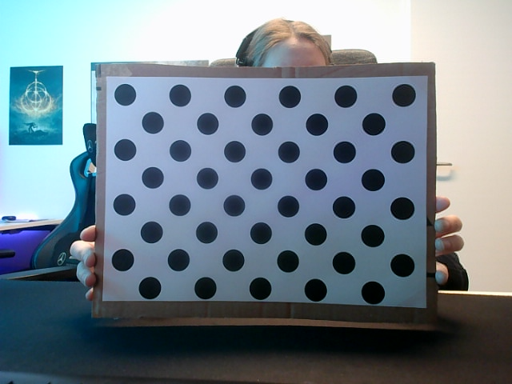

Image with corners detected: \


Calibration Results: \
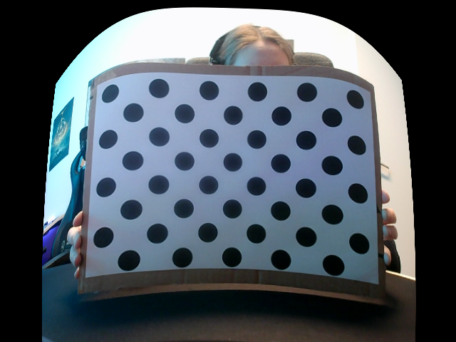

Visualization with Vector Field: \
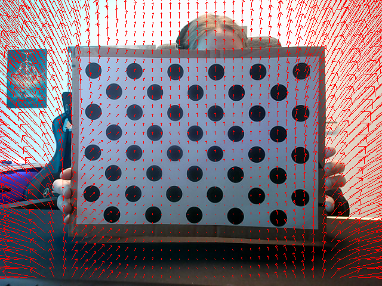

Visualization with Heatmap: \
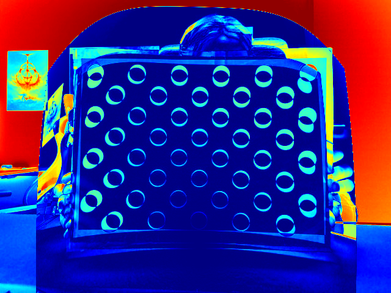

Visualization with Checkerboard: \
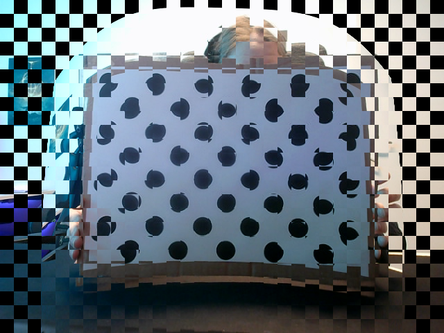

