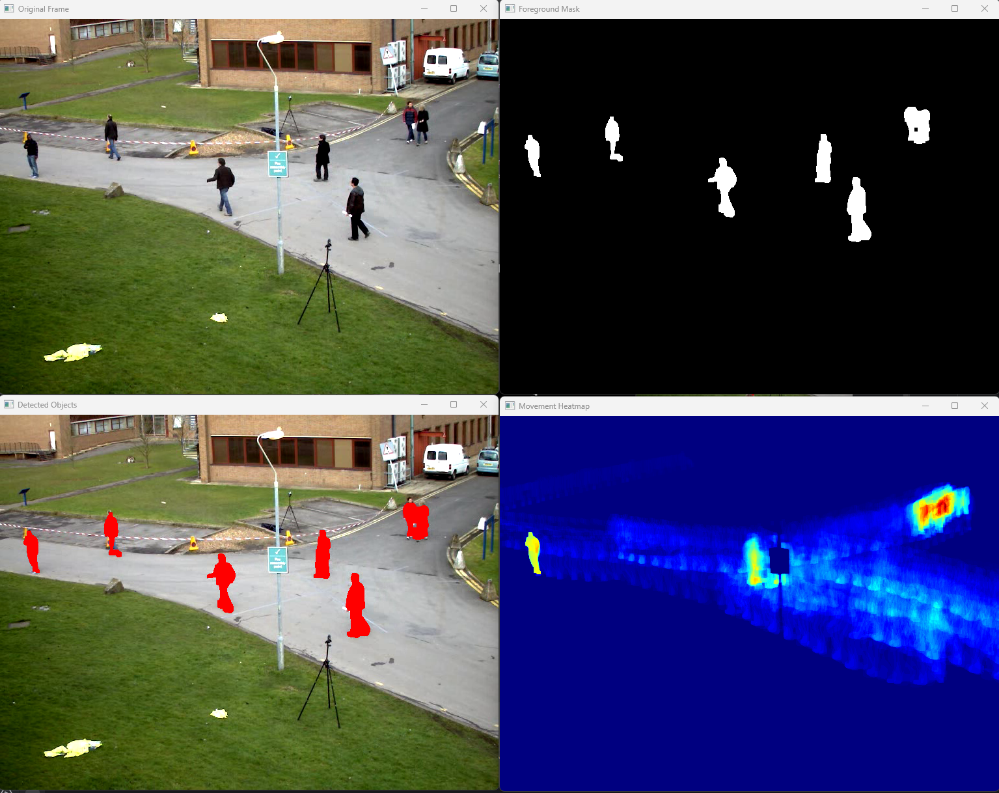
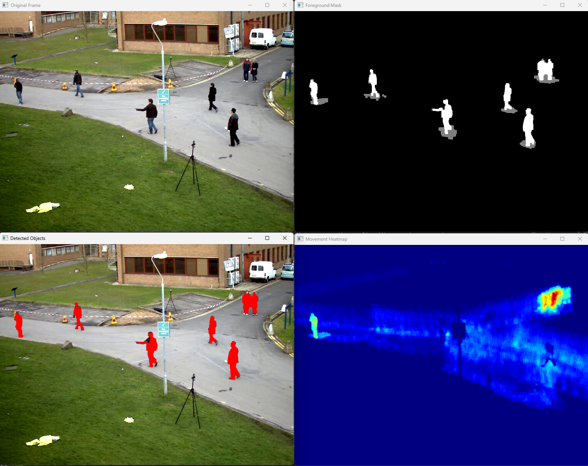
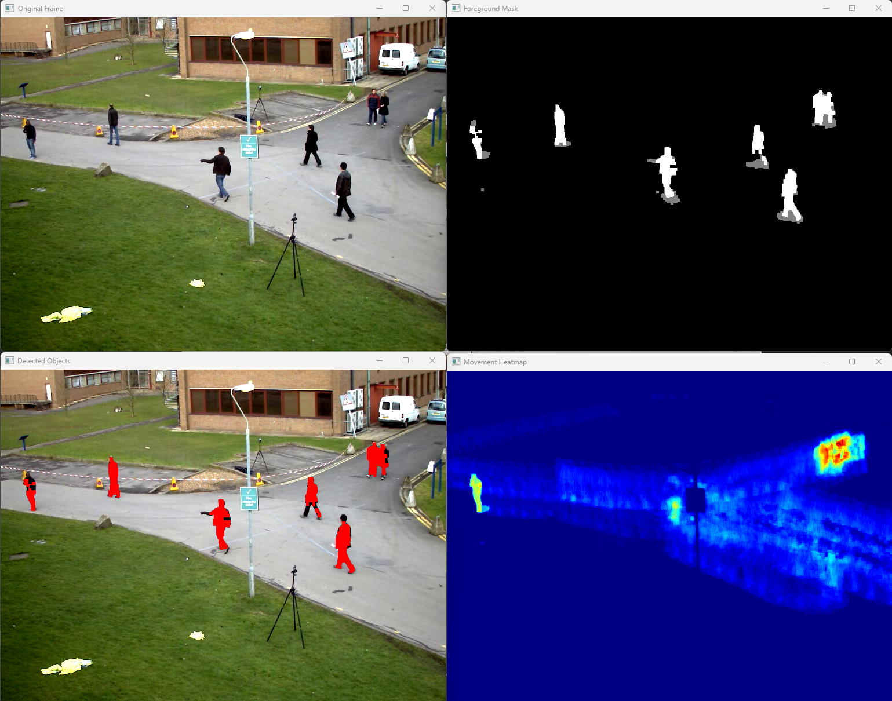
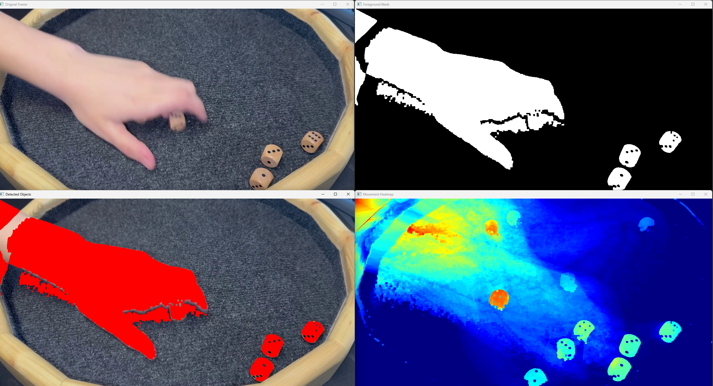
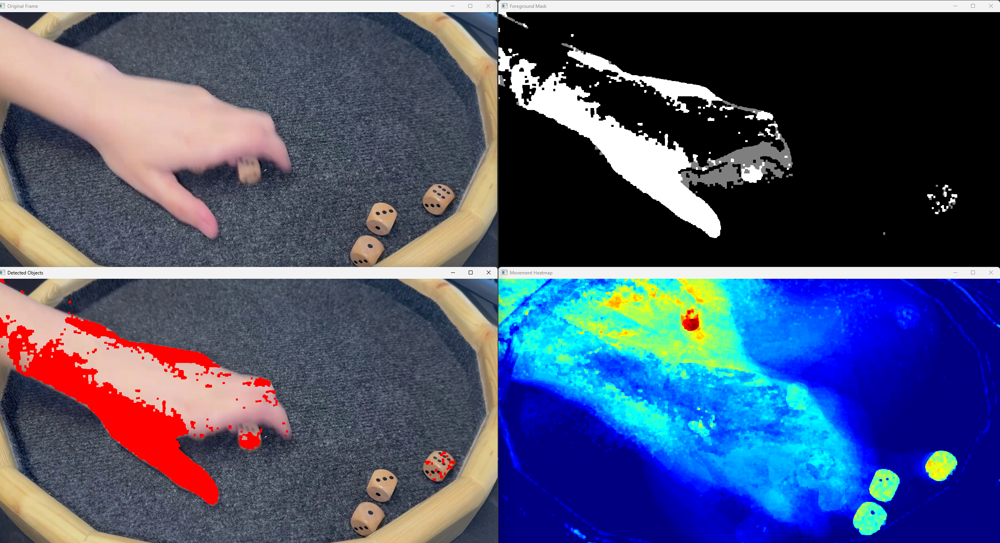
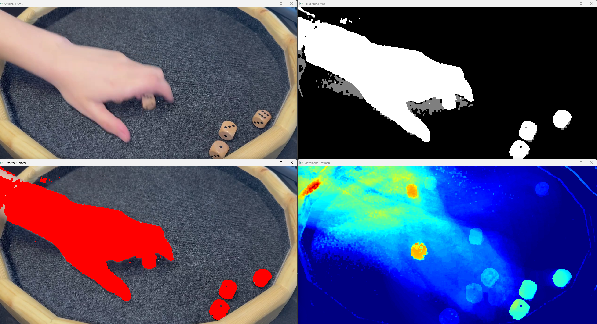
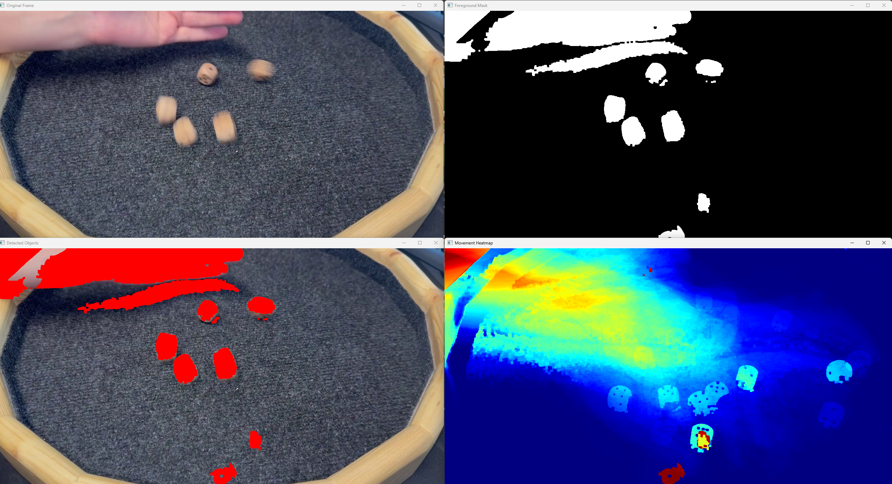
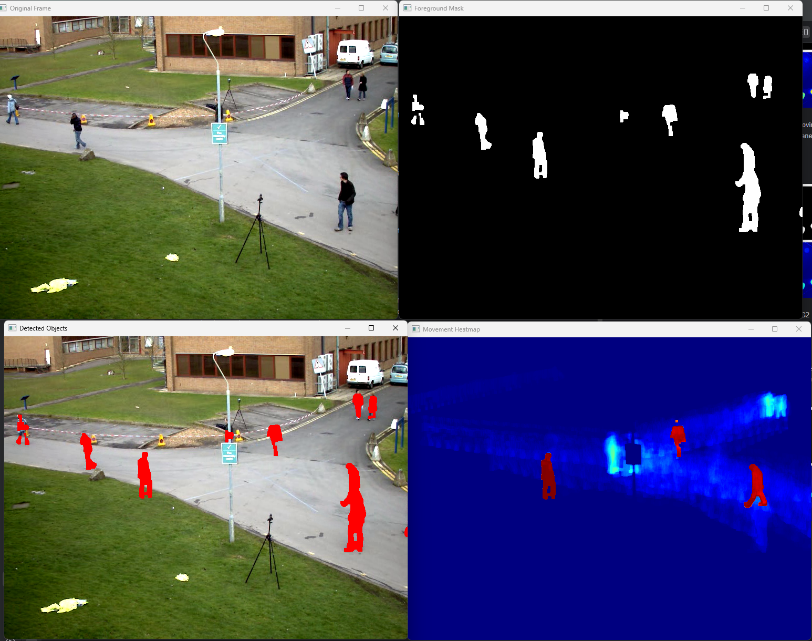

# Movement Detection in Videos

## Aim
The aim of this project is to develop an algorithm that detects moving objects in static video scenes. 
The approach involves building a background model from the initial frames and identifying changes 
in the following frames to detect moving objects. Three different background substraction methods are being looked at: 
a custom approach and two other implementations from the OpenCV library. (using `MOG2`and `KNN`)

## Implementation
### Background Model
A good background model is essential for detecting moving objects accurately.
- In a training phase the first `n` frames are captured to build a background model.
- The frames are converted to grayscale with `cvtColor` and to reduce noise a Gaussian blur is applied with `GaussianBlur`.
- After obtaining every frame the median of the pixel values is calculated to get the background model.

### Moving Object Detection
After calculating the background model the video is reset to the first frame to start the detection.
- The frame is again converted to grayscale and blurred with a Gaussian blur.
- The absolute difference between the background model and the current frame is calculated.
- A threshold is applied to the difference image to get a binary image which shows the moving objects.
- The background is updated using `accumulateWeighted` to adapt to changes in the scene. 
This is only done where no moving objects are detected to avoid that objects become part of the background 
when staying in the same place for a long time.
- Morphological operations are applied to the binary image to remove noise and to connect close objects. 
This is done by using `morphologyEx` with the `MORPH_CLOSE` (removes small white spots) and `MORPH_OPEN` (removes small black spots) flags.
- The binary image is used to create a mask which is applied to the original frame to show the moving objects in red.

### Heatmap
To visualize the movement of objects a heatmap is created. The functions `normalize` and `applyColorMap` are used to create a heatmap from each frame's binary image.

### OpenCV Background Subtraction
Two OpenCV implementations `MOG2` and `KNN` were used to compare the results with my custom approach.

- `MOG2` is a Gaussian Mixture-based Background/Foreground Segmentation Algorithm. It uses a method to model each pixel as a mixture of Gaussians.
- `KNN` is a K-Nearest Neighbors approach to background subtraction. It uses a method to model each pixel as a mixture of K-nearest neighbors.

## Code
```python
import cv2
import numpy as np
from enum import Enum

# Background subtraction methods
class BackgroundSubtractionMethod(Enum):
    CUSTOM = 1
    MOG2 = 2
    KNN = 3

background_subtraction_method = BackgroundSubtractionMethod.MOG2

# Video input
# inVideoPath = "videos/vtest.avi"
inVideoPath = "videos/wuerfel.mp4"
capture = cv2.VideoCapture(inVideoPath)
if not capture.isOpened():
    print("Unable to open video file")
    exit(0)

# Parameters
alpha = 0.02  # Background update rate
training_frames = 20  # Number of frames used for background initialization
frame_count = 0
background = None
heatmap = None
heatmap_alpha = 0.01  # Learning rate for heatmap update

# OpenCV background subtractors
fgbg_mog2 = cv2.createBackgroundSubtractorMOG2()
fgbg_knn = cv2.createBackgroundSubtractorKNN()

# Training phase: Collect initial background model if using custom method
training_images = []
if background_subtraction_method == BackgroundSubtractionMethod.CUSTOM:
    while frame_count < training_frames:
        ret, frame = capture.read()
        if not ret:
            break
        # Convert frame to grayscale
        frame_gray = cv2.cvtColor(frame, cv2.COLOR_BGR2GRAY)
        frame_gray = cv2.GaussianBlur(frame_gray, (5, 5), 0)  # Reduce noise
        training_images.append(frame_gray.astype(np.float32))
        frame_count += 1

    # Compute median background model from training frames
    if training_images:
        background = np.median(np.array(training_images), axis=0).astype(np.float32)

    # Reset video to start processing after training phase
    capture.set(cv2.CAP_PROP_POS_FRAMES, training_frames)

while True:
    ret, frame = capture.read()
    if not ret:
        break

    #Convert frame to grayscale
    frame_gray = cv2.cvtColor(frame, cv2.COLOR_BGR2GRAY)
    frame_gray = cv2.GaussianBlur(frame_gray, (5, 5), 0)  # Reduce noise

    # Custom Background Subtraction Method
    if background_subtraction_method == BackgroundSubtractionMethod.CUSTOM:
        # Convert difference to grayscale for better object detection
        background_uint8 = cv2.convertScaleAbs(background)
        diff_frame = cv2.absdiff(background_uint8.astype(np.uint8), frame_gray)

        # Thresholding to create a binary moving object mask
        _, fg_mask = cv2.threshold(diff_frame, 30, 255, cv2.THRESH_BINARY)

        # Update background only where no motion is detected
        motion_free = cv2.bitwise_not(fg_mask)
        background = cv2.accumulateWeighted(frame_gray.astype(np.float32), background, alpha, mask=motion_free)

    # OpenCV Background Subtraction Methods MOG = Mixture of Gaussians
    elif background_subtraction_method == BackgroundSubtractionMethod.MOG2:
        fg_mask = fgbg_mog2.apply(frame)

    # OpenCV Background Subtraction Methods KNN = K-Nearest Neighbors
    elif background_subtraction_method == BackgroundSubtractionMethod.KNN:
        fg_mask = fgbg_knn.apply(frame)

    # Morphological operations to remove noise
    kernel = np.ones((5, 5), np.uint8)
    fg_mask = cv2.morphologyEx(fg_mask, cv2.MORPH_OPEN, kernel)
    fg_mask = cv2.morphologyEx(fg_mask, cv2.MORPH_CLOSE, kernel)

    # Apply red color to detected objects on the original frame
    frame_with_objects = frame.copy()
    frame_with_objects[fg_mask == 255] = [0, 0, 255]  # Red color overlay

    # Update heatmap
    if heatmap is None:
        heatmap = np.zeros_like(fg_mask, dtype=np.float32)
    heatmap = cv2.addWeighted(heatmap, 1 - heatmap_alpha, fg_mask.astype(np.float32), heatmap_alpha, 0)

    # Normalize and colorize heatmap
    heatmap_norm = cv2.normalize(heatmap, None, 0, 255, cv2.NORM_MINMAX)
    heatmap_color = cv2.applyColorMap(heatmap_norm.astype(np.uint8), cv2.COLORMAP_JET)

    # Display results
    cv2.imshow("Original Frame", frame)
    cv2.imshow("Foreground Mask", fg_mask)
    cv2.imshow("Movement Heatmap", heatmap_color)
    cv2.imshow("Detected Objects", frame_with_objects)

    if cv2.waitKey(30) & 0xFF == 27:  # Press ESC to exit
        break
```

## Results
### Pedestrian video 
#### Custom Approach


We can see that the moving object detection works okay. The background model is not perfect and the detection is not 
always accurate. For example a moving object that has a similar color to the background is not always detected.
However, if some people stand still for a while it does not mess up the background model and they are still detected as a moving object.

#### MOG2


The detection in this method is closer to the object, or more "tight-fitting," compared to the custom approach.

#### KNN


The results of this background subtraction seems to be a bit worse than the other two, since rather large parts of the moving objects are not detected.

### Rolling dice video
#### Custom Approach


Here, you can observe that objects with colors similar to the background 
(such as the hand and the wood, as well as the dice numbers and fabric) are not marked as moving objects. 
This issue is less pronounced in the KNN method. 
Additionally, the shadow is significantly more pronounced in this method compared to the others.

#### MOG2


The objects were only shortly detected. Once they stopped moving they were not marked as moving objects anymore. This happened rather fast. 
Sometimes some dices were not detected at all. 

#### KNN 


Here the objects were detected a bit longer than with the MOG2 approach.

### Notes on Training phase
It is important to have a fitting training phase without moving objects, otherwise the background model 
would not be accurate and would for example have some objects in it as can be seen here at the bottom:


or here in the middle:


## Used Libraries
- OpenCV: image processing and background subtraction
- Numpy: mathematical operations on arrays
- enum: enumerations for the background subtraction methods
