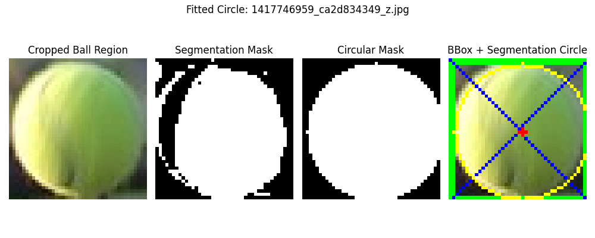
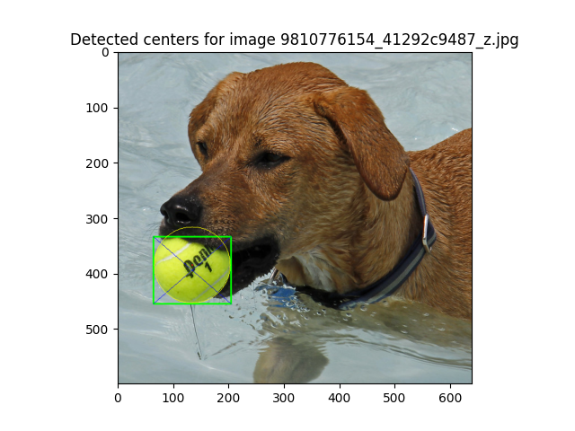
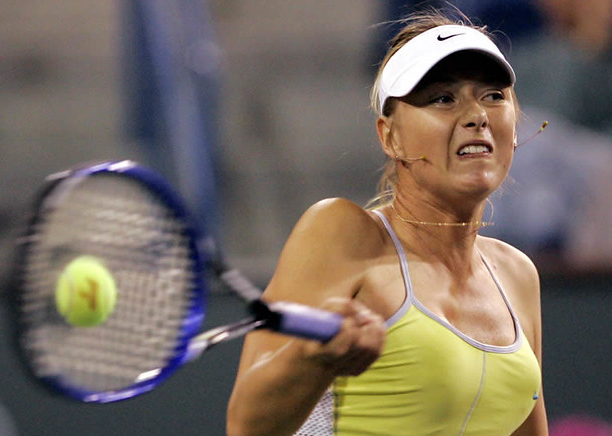

# Ball Detection and Segmentation
## Aim
The aim of this project is to evaluate how accurately an object detector (YOLO) can localize a tennis ball, 
using its bounding box center as an estimate of the tennis ball's center.
Since object detectors do not always place bounding boxes exactly centered over the object, 
the project investigates whether segmentation within the bounding box can provide a more precise estimate of the ball’s center.

## Implementation
### Object Detection with YOLO11n
- YOLO11 is the newest generation of the YOLO object detection algorithm in the Ultralytics library. (Source: [https://docs.ultralytics.com/de/models/yolo11/](https://docs.ultralytics.com/de/models/yolo11/))
- With ` model.predict(img_path, classes=[32])` only the class 32 (= sports ball) is detected. (Source: [https://docs.ultralytics.com/de/datasets/detect/coco/](https://docs.ultralytics.com/de/datasets/detect/coco/))

### Simple Color-Based Segmentation
- The segmentation is done by using a simple color-based approach with a color range that fits most images.
- The color range was determined by testing some yellow-green colors until good results were achieved:
  - `lower_yellow = np.array([0, 80, 80])` \
    
  - `upper_yellow = np.array([100, 255, 255])` \
     
- The mask is then created by using the `cv2.inRange()` function, which creates a binary mask where the pixels within the specified color range are set to 255 (white) and all other pixels are set to 0 (black).

### Ball Detection and Center Distance Calculation
- With `cv2.findContours(mask, cv2.RETR_EXTERNAL, cv2.CHAIN_APPROX_SIMPLE)` the contours of the ball are calculated. `RETR_EXTERNAL` is used to only get the outer contours and `CHAIN_APPROX_SIMPLE` is used to compress the contour points.
- Since the segmentation does not always return a perfect circle (e.g. when the ball is partly hidden), `cv2.minEnclosingCircle()` is used to get the smallest enclosing circle of the contour.
- The circle mask is created.
- After calculating the center of the bounding box and the center of the segmented circle, the distance between the two centers is calculated using the Euclidean distance formula.

### Visualization
The following visualizations are created:
- Cropped Ball Region: shows the original ball
- Segmentation Mask: shows the segmented ball
- Circular Mask: shows the improved circle enclosing the ball
- BBox + Segmentation Circle: shows the Bounding Box and the diagonals to see the center, as well as the segmented circle and its center

### Statistics
The following statistics are calculated (the distances between the center of the bounding box and the center of the segmented circle are looked at):
- Key numbers (min, max, mean distance and standard deviation)
- Histogram of the center distances
- Scatter plot of the center points

<div style="page-break-after: always;"></div>

## Results
### Example 1: 



<div style="page-break-after: always;"></div>

### Example 2: (Disclaimer: I did not find a good tennis match image, where the ball was slightly covered)
The differences between the bounding box center and the segmented circle center are quite large here.
This is because part of the ball is covered by the dogs mouth, which makes the bounding box and its center inaccurate.
In this case the segmentation mask and its center are more accurate.



<div style="page-break-after: always;"></div>

### Example 3:


<div style="page-break-after: always;"></div>

### Statistics
```
--- Center Analysis ---
Number of tennis balls analyzed: 12
Min distance: 1.00 pixels
Max distance: 9.00 pixels
Mean distance: 2.91 pixels
Std deviation: 2.55 pixels
```

### Histogram of the center distances


<div style="page-break-after: always;"></div>

### Scatter plot of the center points


<div style="page-break-after: always;"></div>

## Limitations
### Color
The segmentation that was used depends heavily on lighting conditions and the background color.

For example, in this image, the tennis ball is exposed to a very bright light and the background is very similar to the ball color.


This results in the bounding box center being clearly more accurate than the segmentation center.


<div style="page-break-after: always;"></div>

### Shape
Another aspect that could be improved is determining the shape of the ball. With the current implementation the tennis ball 
is detected as a circle, but in reality it is often more oval (e.g. due to motion blur, deformation, etc.).

In this image the tennis ball is clearly more oval than round.


Therefore, the segmentation mask would be better if it would be more oval as well.


<div style="page-break-after: always;"></div>

### Resolution
The distance is currently calculated in pixels. This means that the values are resolution-dependent and 
therefore not directly comparable between images with different resolutions. 
A distance of 10 pixels in a low-resolution image may represent a much larger real-world shift 
than the same 10 pixels in a high-resolution image.

## Source
Some images were taken from the COCO dataset: \
[https://cocodataset.org/#explore](https://cocodataset.org/#explore)

Other images were taken from the Open Images dataset: \
[https://storage.googleapis.com/openimages/web/visualizer/index.html?type=detection&set=train&c=%2Fm%2F05ctyq](https://storage.googleapis.com/openimages/web/visualizer/index.html?type=detection&set=train&c=%2Fm%2F05ctyq)


## Used Linaries
- OpenCV: for image processing 
- NumPy: for numerical operations
- Matplotlib: for plotting 
- Ultralytics: for YOLO11 object detection
