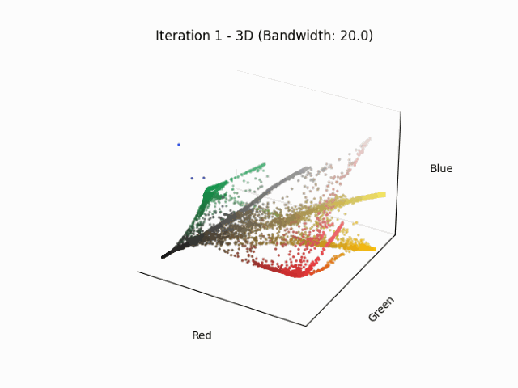
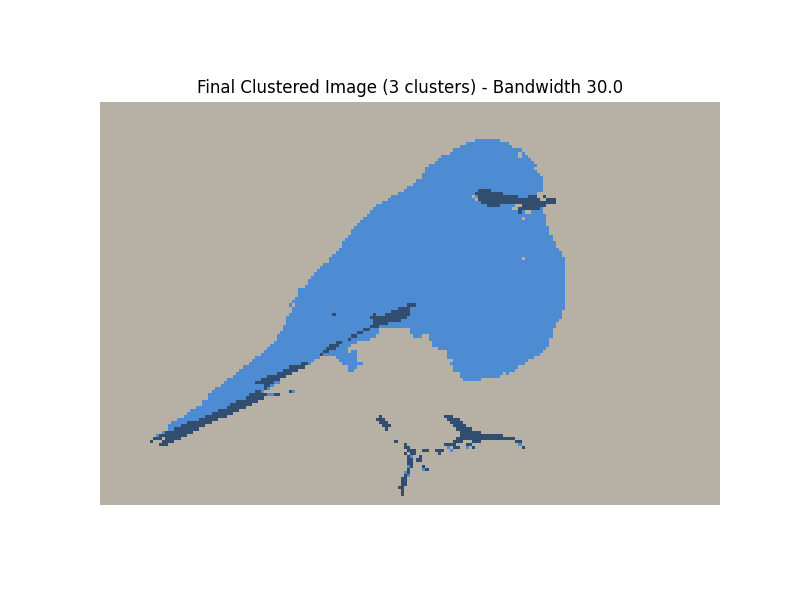

# Mean Shift
## Aim
The aim of this project is to implement Mean Shift clustering for color images, 
where the bandwidth is the only input provided by the user. 
The algorithm groups similar colors in the RGB space using a Gaussian kernel and 
outputs a final clustered version of the image. Additionally, the implementation includes:
- Visualization I: Animation of the clustering process in both 2D image space and 3D RGB color space as a gif
- Visualization II: Visualization of the 3D color density topography of an image to see the color distribution.

## Implementation
### Core Algorithm 
`mean_shift_color_pixel` performs the actual mean shift procedure.
- Input: 
  - flattened array of RGB pixel values
  - bandwidth, which controls the size of the neighborhood
- For every iteration:
  - the color of every pixel is shifted towards the weighted average of similar colored pixels
  - the weights are determined by `gaussian_weight`, which calculates the weight using the Gaussian kernel
  - this is repeated until maximum shift is less than a threshold or the maximum number of iterations is reached
  - if the `record_frames` flag is set to True, the function also stores the frames of every iteration for later visualization

- Output: 
  - the final color of each pixel after clustering
  - optionally the frames of the clustering process for visualization

Once the pixel colors have converged, the function `assign_clusters` groups the pixels into their clusters:
- Each pixel is assign to an existing cluster if its distance to the cluster center is below a threshold (distance is calculated with `colour_dist`)
- If no cluster is found, a new cluster is created

### Visualization I
The function `create_visualization_frames` is used in `mean_shift_color_pixel` to create the frames for the animation.
Creates:
- a 2D image from current pixel values reshaped back to image format
- a 3D RGB scatter plot showing the distribution of pixel colors

This is later used to create gifs using `matplotlib.animation`

### Visualization II
The function `color_density_3D` visualizes the overall color distribution in RGB space as a 3D surface plot, 
using Gaussian Kernel Density Estimation. To enable a 3D visualization, the blue channel is fixed to a constant 
value (e.g., B = 128), allowing a two-dimensional grid to be created over the red and green channels.
The resulting surface shows the estimated density of colors for each [R, G] combination, 
indicating which regions in color space are most frequently represented in the image.

### Main
For each example image:
- runs the 3D color density topography
- iterates through some bandwidth values
- runs mean shift clustering and creates animations
- clusters results and saves the resulting image

### Performance 
To speed up the process, the code uses Numba JIT compilation to accelerate the mean shift algorithm.

## Results
Note: 
- To view the animations, the gifs themselves (located in the `result` folder) or the markdown file need to be opened. I only show screenshots of the a few animation iterations for the Pepper image.
- The original images were downsized for faster processing.

### Peppers
#### Original Image

#### Result with different bandwidths

The bandwidth has a significant impact on the clustering result. 
It determines the size of the neighborhood used for averaging, where a small bandwidth leads to many small, 
detailed clusters, while a large bandwidth results in fewer, broader clusters by smoothing over fine color differences.

#### Visualization I: 2D Animation Iteration

#### Visualization I: 3D Animation Iteration

#### Visualization I for Bandwidth 10 (due to pdf convertion, the gifs are not animated)

#### Visualization I for Bandwidth 20 (due to pdf convertion, the gifs are not animated)

#### Visualization I for Bandwidth 30 (due to pdf convertion, the gifs are not animated)

#### Visualization II 3D Color Density Topography

### Gas Station
#### Original Image

#### Result with different bandwidths

#### Visualization I for Bandwidth 10 (due to pdf convertion, the gifs are not animated)

#### Visualization I for Bandwidth 20 (due to pdf convertion, the gifs are not animated)

#### Visualization I for Bandwidth 30 (due to pdf convertion, the gifs are not animated)

#### Visualization II 3D Color Density Topography

### Blue Bird
#### Original Image

#### Result with different bandwidths

#### Visualization I for Bandwidth 10 (due to pdf convertion, the gifs are not animated)

#### Visualization I for Bandwidth 20 (due to pdf convertion, the gifs are not animated)

#### Visualization I for Bandwidth 30 (due to pdf convertion, the gifs are not animated)

#### Visualization II 3D Color Density Topography

## Used Libraries
- `NumPy` – numerical operations
- `OpenCV` – image loading and saving
- `Matplotlib` – visualization (2D/3D, animation)
- `Numba` – performance optimization via JIT
- `SciPy` – KDE density estimation
- `os`, `io` – file handling and in-memory image buffers
