# Richardson Lucy Deconvolution

## Aim
The goal of this project is to implement an iterative image restoration algorithm using 
the Richardson-Lucy Deconvolution (RLD) technique from scratch in Python, with minimal dependencies.
The algorithm attempts to recover a sharp image A from a blurred and noisy observation B, 
given a known Point Spread Function (PSF) or kernel K.

## Implementation
### Richardson-Lucy Deconvolution
The core iterative algorithm is implemented in the `richardson_lucy(b, k, iterations=30, init_img=None)` function with:
- `b`: blurred (and noisy) input image
- `k`: Point Spread Function (PSF) or kernel used for blurring
- `init_img`: initial guess for the sharp image
- `iterations`: number of iteration steps to perform

There are a few main steps to this algorithm:
#### Preprocessing:
Before entering the iteration loop, some essential preprocessing is done to ensure 
numerical stability and consistent data types:
- The input image `b` is converted to a float32 type for no round-off errors during calculations and 
a small epsilon value is added to avoid division by zero: `b = b.astype(np.float32) + 1e-6`
- The initial guess image `init_img` is also converted to float32 type: `a_est = init_img.astype(np.float32)`
- The kernel `k` is normalized to ensure that the sum of its elements equals 1. 
This prevents unintended changes in overall image brightness during the deconvolution process: `k = k / k.sum()`
- The kernel is flipped horizontally and vertically to create `k_mirror`, which is used in the deconvolution process: `k_mirror = k[::-1, ::-1]`
This has to be done if the kernel is not symmetric, because the deconvolution step requires the mirrored version to 
correctly reverse the blurring effect.

#### Step1: Convolve current estimate with PSF
The current estimate of the image is blurred using the same PSF K:
```python
conv = cv2.filter2D(a_est, -1, k, borderType=cv2.BORDER_REFLECT)
```

<div style="page-break-after: always;"></div>

#### Step 2: Calculate the ratio
The observed image is divided by the blurred estimate to get the ratio, to avoid division by zero, 1e-6 is added:
```python
ratio = b / (conv + 1e-6)
```

#### Step 3: Convolve the ratio with the flipped PSF and update the estimate
This provides a correction factor and the estimate is updated by element-wise multiplication. The estimate is clipped to 
ensure pixel values remain within valid bounds (0-255):
```python
correction = cv2.filter2D(ratio, -1, k_mirror, borderType=cv2.BORDER_REFLECT)
a_est *= correction
a_est = np.clip(a_est, 1e-6, 255)
```

#### Step 5: Update the estimate
This is an optional step that stops the algorithm early if the estimate converges, 
the previous estimate is stored before and the difference between the current and previous estimates is calculated:
```python
delta = np.linalg.norm(a_est - prev)
if delta < 1e-2:
    print(f"Converged at iteration {i+1}")
    return np.clip(a_est, 0, 255).astype(np.uint8), i+1
```

<div style="page-break-after: always;"></div>

### PSF Kernel Definition
With the function `get_kernels(kernel_size)`, the following kernels are generated with `kernel_size` as input:
- **Mean Kernel**: A uniform kernel that averages pixel values in a local neighborhood. 
It divides the sum of all pixel values in the region equally.
- **Gaussian Kernel**: A Gaussian kernel that weights pixel values based on their distance from the center. 
The standard deviation kernel_size / 3 ensures the kernel decays smoothly from center to edge.
- **Motion Kernel**: A kernel that simulates motion blur in a specific direction, in this case horizontal. 
It spreads intensity evenly across a horizontal line of kernel_size pixels.
- **Motion Asymmetric Kernel**: A kernel that simulates motion blur with an asymmetric distribution. This kernel is filled with
random values.
- **Custom Kernel**: A custom kernel that can be provided by the user as an image.
```python
  motion_asym = np.random.rand(1, kernel_size).astype(np.float32)
  motion_asym /= motion_asym.sum()

  kernels = {
      "mean": np.ones((kernel_size, kernel_size), dtype=np.float32) / (kernel_size ** 2),
      "gaussian": cv2.getGaussianKernel(kernel_size, kernel_size / 3) @
                  cv2.getGaussianKernel(kernel_size, kernel_size / 3).T,
      "motion_horizontal": np.ones((1, kernel_size * 2), dtype=np.float32) / (kernel_size * 2),
      "motion_asymmetric": motion_asym,
  }

  # load custom kernel if path is given
  if custom_kernel_path is not None:
      custom_kernel = cv2.imread(custom_kernel_path, cv2.IMREAD_GRAYSCALE)
      if custom_kernel is not None:
          kernels["custom"] = custom_kernel.astype(np.float32) / np.sum(custom_kernel)
      else:
          print(f"Warning: Custom kernel at '{custom_kernel_path}' could not be loaded.")

  return kernels
```

<div style="page-break-after: always;"></div>

### Noise
For each kernel, a noise is added to the blurred image using different noise levels (standard deviations):
```python
noise_levels = [0, 5, 10, 20]
```

### Initial Guess Image
Four different initial guess images are generated:
- **Random**: A random image generated using `np.random.rand(*b_noisy.shape) * 255`
- **Observed**: The observed blurred image `b_noisy.copy()`
- **Gray127**: A gray image with all pixel values set to 127 `np.full_like(b_noisy, 127)`
- **Custom**: A custom image. This can be any image, that is loaded.

## Results
### Test Setup
The algorithm can be tested with various combinations, but to keep the documentation short and simple I focused on the
following setup configurations:
- **Input Image**: all have the same size of 800x800 pixels so that the kernel size is right for every image
  - cars on the road with visible license plates: well suited, since it has characters on the license plates that can be 
    recognized
  - simple checkerboard 
- **Kernel**: mean, gaussian, motion_horizontal, motion_asymmetric
- **Noise Level**: 0, 5, 10
- **Initial Guess**: random, observed, gray127, custom (donald duck)
- **Iterations**: 30
- **Kernel-Size**: 10

### Results
#### Kernel: Mean
##### Noise Level: 0
With this setup the deconvolution works well, the image is restored to a good quality and the license plate is displayed 
clearly whereas in the blurred image it is not readable. The initial guess does have a big impact on the result.
This is most prominent in the custom image, Donald Duck is still recognizable in the deconvolve image. The observed 
image as the initial guess leads to the best result, since it is already very close to the original.
However, the gray image also leads to very good result. When using the random image as initial guess, the artifacts 
are very visible.

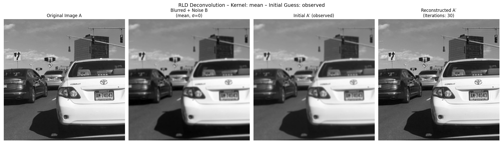

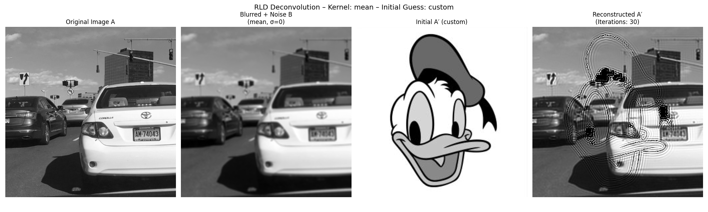


<div style="page-break-after: always;"></div>

##### Noise Level: 10
When introducing noise the result becomes naturally a little bit worse, but the algorithm is still able to recover a lot of details.
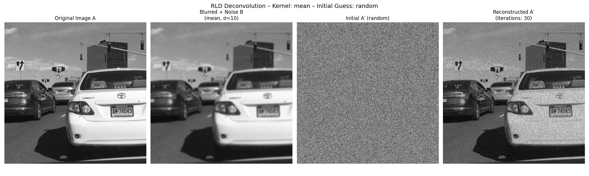


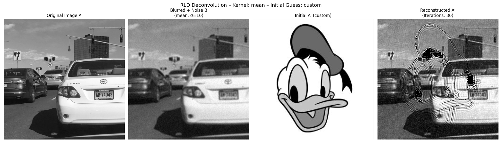


<div style="page-break-after: always;"></div>

#### Kernel: Gaussian
##### Noise Level: 0
The blurred effect with the gaussian kernel is a little bit softer since it weights the pixels based on their distance 
from the center. The deconvolution works well. 
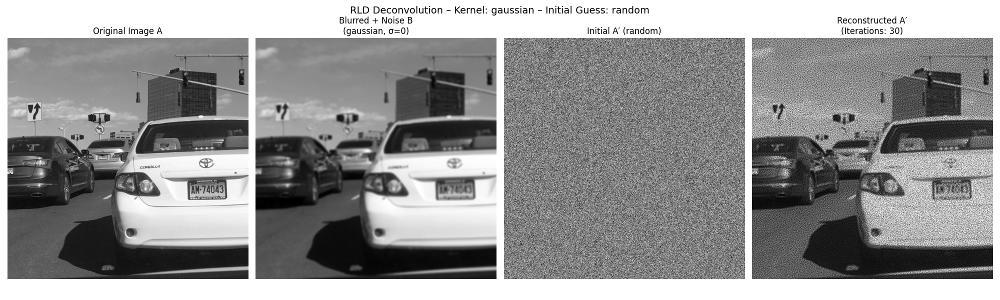
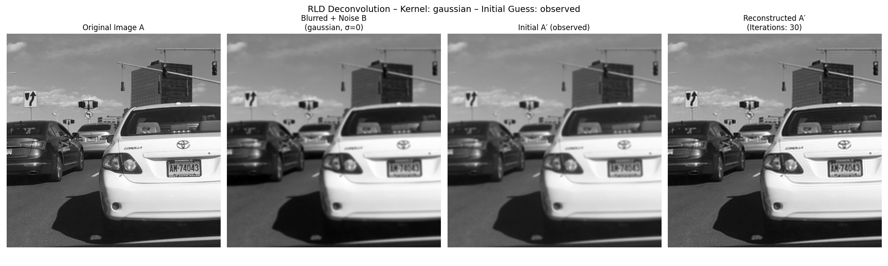

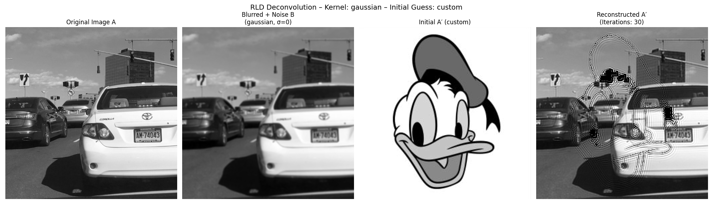

Higher Noise Level looks similar, so no additional images are shown here.

<div style="page-break-after: always;"></div>

#### Kernel: Horizontal Motion
##### Noise Level: 0
With the horizontal motion kernel, the blur is only applied in the horizontal direction. This means that the vertical 
lines are blurred stronger, horizontal structures stay more or less intact. 
This can be best observed in the checkerboard image or at the vertical lines in the car image (e.g. signs). When using the custom image, the ringing artefacts are very visible 
in the directions of the blur. 
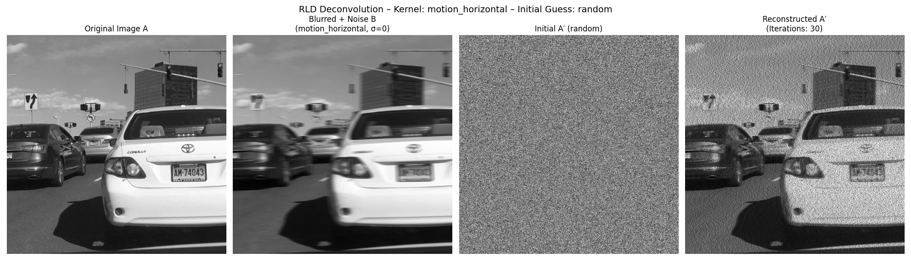
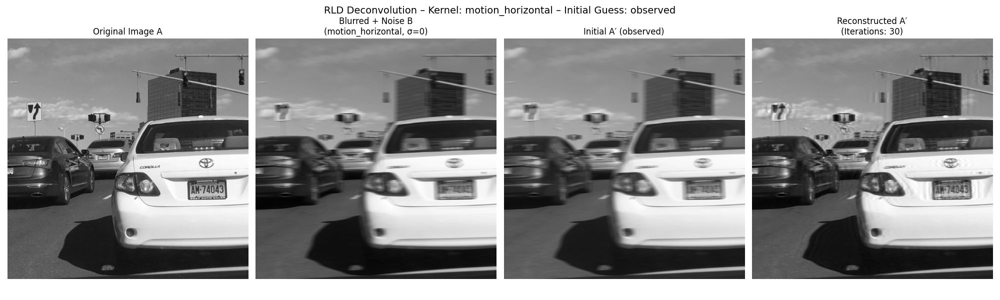
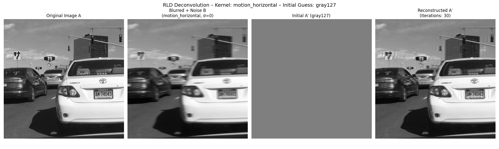
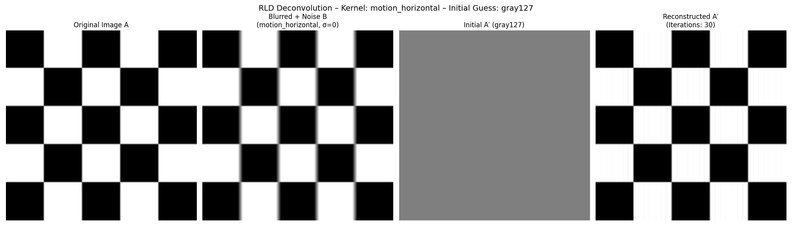


<div style="page-break-after: always;"></div>

##### Noise Level: 10
The vertical lines are more visible here.


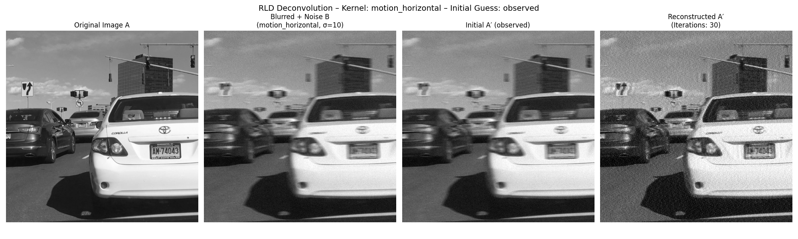

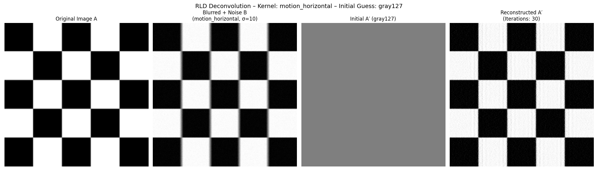


<div style="page-break-after: always;"></div>

#### Kernel: Motion Asymmetric
##### Noise Level: 0
This kernel is used to show that an asymmetric kernel can be used to simulate a more complex motion blur. 
For this kernel it is import to mirror the kernel in the right direction, otherwise the deconvolution will not work properly.
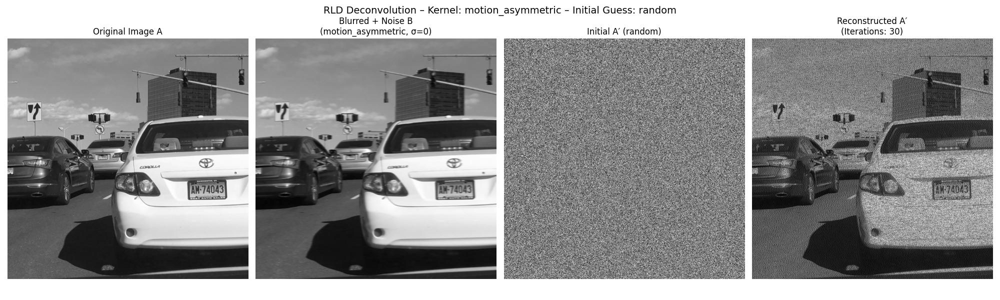


Higher Noise Level looks similar, so no additional images are shown here.
